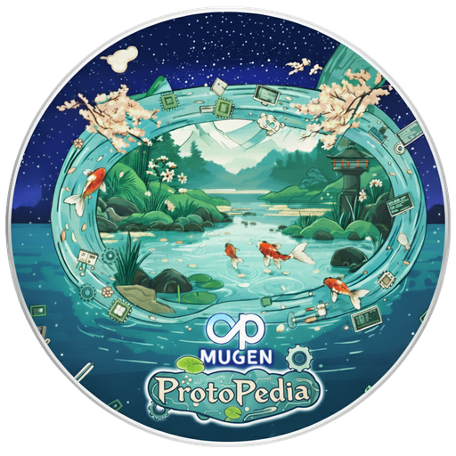

# MUGEN ProtoPedia (無限 ProtoPedia)

Endless exploration of prototypes in [ProtoPedia](https://protopedia.net/). Unpredictable encounters spark creativity. Embrace serendipitous discoveries.

[ProtoPedia（プロトペディア）](https://protopedia.net/)に登録されているプロトタイプを無限探索。予測不能な出会いが、創造性を刺激する。偶然の発見を楽しもう。

## Key Features / 特徴

- 📱 Enjoy Anywhere / どこでも楽しめる
    - Responsive design optimized for smartphones and narrow screens. Explore prototypes anytime, anywhere — during your commute or on the go.
    - スマートフォンなどの狭い画面でも快適に操作できるレスポンシブデザイン。通勤中や移動中でも、いつでもどこでもプロトタイプ探索を楽しめます。

- ⌨️ Premium Experience / 最高の体験を
    - Enhanced for large screens with powerful keyboard shortcuts (`Enter`, `j/k`, `r`, etc.). Experience efficient browsing and discover more prototypes on desktop.
    - 大きなスクリーンとキーボードショートカット（`Enter`, `j/k`, `r` など）で、デスクトップ環境でも最高の体験を提供。効率的なブラウジングで、より多くのプロトタイプに出会えます。

- ▶️ Playlist Playback Mode / プレイリスト再生モード
    - Auto‑play a curated list of prototypes just by opening a playlist URL. Showcase your personal collection or an event lineup seamlessly. Includes a built‑in playlist builder.
    - プレイリストURLを開くだけで選択した作品が自動連続再生。自分の作品集やイベントの登壇順リストとして楽しめる。ブラウザ上で簡単にプレイリスト生成も可能。

## About ProtoPedia

[ProtoPedia](https://protopedia.net/) is a Japanese creative platform with the tagline "つくる、たのしむ、ひろがる" (Create, Enjoy, Expand). It serves as a community hub where makers, developers, and creators share their prototype projects across diverse categories:

- **Software Development**: Applications, games, AI/data science, blockchain, AR/VR
- **Hardware**: Electronics, robotics, wearables, IoT
- **Design/Art**: Visualization, interactive design, media art
- **Making/DIY**: Digital fabrication, woodworking, upcycling

This app leverages the ProtoPedia API to deliver an endless stream of inspiring prototypes from this vibrant maker community.

[ProtoPedia（プロトペディア）](https://protopedia.net/)は「つくる、たのしむ、ひろがる」をコンセプトにした日本のクリエイティブプラットフォームです。メイカー、開発者、クリエイターがプロトタイプ作品を共有するコミュニティハブとして、以下のような多様なカテゴリーの作品が集まっています：

- **ソフトウェア開発**: アプリ、ゲーム、AI/データサイエンス、ブロックチェーン、AR/VR
- **ハードウェア**: 電子工作、ロボティクス、ウェアラブル、IoT
- **デザイン/アート**: ビジュアライゼーション、インタラクティブデザイン、メディアアート
- **Making/DIY**: デジタルファブリケーション、木工、アップサイクル

## 🚀 プレイにおすすめの環境

📝 アプリ内から任意のプロトタイプを既定のWebブラウザで開けます。ブラウザ版とインストール版(アプリ/PWA)ではプラットフォームによりハンドオフ挙動が異なる場合があります。お好みの体験を選んでください。

### 🖥️ デスクトップでの利用

インストール版(PWA)とブラウザ版のどちらでも快適に動作します。既存タブとのシームレスな連携を重視する場合はブラウザ版を好む方もいます。

- **Windows / macOS / Linux**
    - **推奨ブラウザ:** 最新の安定版 Chrome または Edge
    - **インストール方法(PWA):** アドレスバーの **Install アイコン** もしくは **ブラウザメニュー** からインストール
    - **メモ:** ブラウザ版/インストール版ともにサポート
- **macOS (Safari)**
    - **サポート:** 対応
    - **インストール方法(PWA):** バージョンによりアドレスバーのボタンまたはメニューから実行可能

### 📱 モバイルでの利用 (インストール版推奨)

ブラウザでも利用可能ですが、ホーム画面に追加(PWAインストール)して使うことで、よりネイティブに近い体験や小さな画面の有効活用が期待できます。

- **Android**
    - **推奨ブラウザ:** 最新の安定版 Chrome
    - **インストール方法(PWA):** 条件を満たすと画面下部に **A2HS(インストール案内)** が表示されることがあります
    - **メモ:** インストール版の方が総合的に快適な場合が多いです
- **iOS / iPadOS**
    - **推奨ブラウザ:** Safari
    - **インストール方法(PWA):** **手動インストールが必要**。**共有ボタン** → **ホーム画面に追加** を選択
    - **メモ:** 自動インストールプロンプトは許可されていません。PWA インストールに対応するのは Safari のみです

## Roadmap / 今後の方針

### 高 (High Priority)

- 新しい「プレイモード」で無限探索体験を強化
    - 未知との遭遇モード (音と光によるコミュニケーション)
    - プロトタイプ・おぼえていますか モード (唐突にアイドルが歌い出す)
    - 巡り会いプロトタイプモード (ニュータイプ専用)
    - HLプレゼン観覧モード (どよめきや拍手喝采、ガヤの効果を演出)
    - フィーバーモード (特定の条件で発動、演出が派手に、カードが瞬時に表示される、忙しい人向け)

### 中 (Medium)

- 分析ダッシュボードを高度化 (キャッシュヒット率 / レイテンシ時系列 / サイズ分布)
- KBショートカットの強化
    - `?` ヘルプ
    - `e` でアーカイブ

### 低 (Low)

- オフラインスナップショットエクスポート (デモ用)

## Changelog

### 2025-12-01

- ️📋 プレイリスト プレビュー

### 2025-11-28

- 🔭 ProtoPedia Observatory (beta) を追加

### 2025-11-27

- 📈 新しい分析情報

### 2025-11-24

- 🧠 データ取得処理の改善、不要なデータ取得を抑制
- ⚡️ プレイリスト再生モードにおける高速表示

### 2025-11-20

- ✨▶️📋 プレイリスト編集機能(beta)を追加

### 2025-11-17

- ✨▶️📋 プレイリスト再生モードを追加
    - [\#ヒーローズリーグ 2025 予選 in 第一部 \(12\) \| 無限ProtoPedia](https://mugen-pp.vercel.app/?title=%23%E3%83%92%E3%83%BC%E3%83%AD%E3%83%BC%E3%82%BA%E3%83%AA%E3%83%BC%E3%82%B0+2025+%E4%BA%88%E9%81%B8+in+%E7%AC%AC%E4%B8%80%E9%83%A8&id=7103,6774,7680,6687,7690,7667,7761,7663,7803,7467,7759,7572)
    - [\#ヒーローズリーグ 2025 予選 in 第二部 \(10\) \| 無限ProtoPedia](https://mugen-pp.vercel.app/?title=%23%E3%83%92%E3%83%BC%E3%83%AD%E3%83%BC%E3%82%BA%E3%83%AA%E3%83%BC%E3%82%B0+2025+%E4%BA%88%E9%81%B8+in+%E7%AC%AC%E4%BA%8C%E9%83%A8&id=7734,7747,6834,7808,6841,7736,7724,7609,7529,7603)
    - [\#ヒーローズリーグ 2025 予選 in 第三部 \(8\) \| 無限ProtoPedia](https://mugen-pp.vercel.app/?title=%23%E3%83%92%E3%83%BC%E3%83%AD%E3%83%BC%E3%82%BA%E3%83%AA%E3%83%BC%E3%82%B0+2025+%E4%BA%88%E9%81%B8+in+%E7%AC%AC%E4%B8%89%E9%83%A8&id=7652,7628,7702,7798,7752,7586,7785,7771)

### 2025-11-14

- 📈🐣 分析情報: 新生児セクションを追加
- 📈🎂 分析情報: 誕生日セクションの改善
- 🎉 記念日判定: 世界のどこでも正しく記念日が到来(日が変わった直後は数十分程度遅れる可能性はある)

### 2025-11-12

- 🖼️ アイコンを刷新: 仮アイコンを廃止し、配信品質の PWA / Apple Touch / maskable アイコン一式に更新

### 2025-11-11

- 🎪 スケルトンカードのバリエーションを追加

### 2025-11-10

- 🔗 素材を表示するリンクを追加
- 🪄 自動スクロール処理を改善
- 🎨 カードの視認性を向上
- 🎯 マウスポインタによるカード選択機能を改善

### 2025-11-09

- 📱 PWA 対応（A2HS）: Web App Manifest & Service Worker でインストール可能に

### 2025-11-08

- 🎊 リリース

## Documentation

- Development Guide: [`docs/development.md`](./docs/development.md)
- Data Fetching Strategy: [`docs/specs/data-fetching-strategy.md`](./docs/specs/data-fetching-strategy.md)
- Analysis Specification: [`docs/specs/analysis.md`](./docs/specs/analysis.md)

## License

MIT © F88. See [`LICENSE`](./LICENSE).

