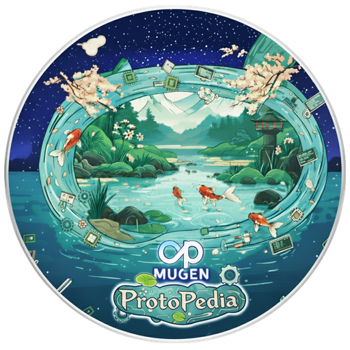

# MUGEN ProtoPedia (無限 ProtoPedia)

Endless exploration of prototypes in [ProtoPedia](https://protopedia.net/). Unpredictable encounters spark creativity. Embrace serendipitous discoveries.

📜 [Player Guide (en)](./docs/player-guide-en.md)

[ProtoPedia（プロトペディア）](https://protopedia.net/)に登録されているプロトタイプを無限探索。予測不能な出会いが、創造性を刺激する。偶然の発見を楽しもう。

📜 [プレイヤーガイド (ja)](./docs/player-guide-ja.md)

## Key Features / 特徴

- 📱 Enjoy Anywhere / どこでも楽しめる
    - Responsive design optimized for smartphones and narrow screens. Explore prototypes anytime, anywhere — during your commute or on the go.
    - スマートフォンなどの狭い画面でも快適に操作できるレスポンシブデザイン。通勤中や移動中でも、いつでもどこでもプロトタイプ探索を楽しめます。

- ⌨️ Premium Experience / 最高の体験を
    - Enhanced for large screens with powerful keyboard shortcuts (`Enter`, `j/k`, `r`, etc.). Experience efficient browsing and discover more prototypes on desktop.
    - 大きなスクリーンとキーボードショートカット（`Enter`, `j/k`, `r` など）で、デスクトップ環境でも最高の体験を提供。効率的なブラウジングで、より多くのプロトタイプに出会えます。

## About ProtoPedia

[ProtoPedia](https://protopedia.net/) is a Japanese creative platform with the tagline "つくる、たのしむ、ひろがる" (Create, Enjoy, Expand). It serves as a community hub where makers, developers, and creators share their prototype projects across diverse categories:

- **Software Development**: Applications, games, AI/data science, blockchain, AR/VR
- **Hardware**: Electronics, robotics, wearables, IoT
- **Design/Art**: Visualization, interactive design, media art
- **Making/DIY**: Digital fabrication, woodworking, upcycling

This app leverages the ProtoPedia API to deliver an endless stream of inspiring prototypes from this vibrant maker community.

[ProtoPedia（プロトペディア）](https://protopedia.net/)は「つくる、たのしむ、ひろがる」をコンセプトにした日本のクリエイティブプラットフォームです。メイカー、開発者、クリエイターがプロトタイプ作品を共有するコミュニティハブとして、以下のような多様なカテゴリーの作品が集まっています：

- **ソフトウェア開発**: アプリ、ゲーム、AI/データサイエンス、ブロックチェーン、AR/VR
- **ハードウェア**: 電子工作、ロボティクス、ウェアラブル、IoT
- **デザイン/アート**: ビジュアライゼーション、インタラクティブデザイン、メディアアート
- **Making/DIY**: デジタルファブリケーション、木工、アップサイクル

## Roadmap / 今後の方針

### 高 (High Priority)

- 新しい「プレイモード」で無限探索体験を強化
    - 未知との遭遇モード (音と光によるコミュニケーション)
    - プロトタイプ・おぼえていますか モード (唐突にアイドルが歌い出す)
    - 巡り会いプロトタイプモード (ニュータイプ専用)
    - HLプレゼン観覧モード (どよめきや拍手喝采、ガヤの効果を演出)
    - フィーバーモード (特定の条件で発動、演出が派手に、カードが瞬時に表示される、忙しい人向け)

### 中 (Medium)

- 分析ダッシュボードを高度化 (キャッシュヒット率 / レイテンシ時系列 / サイズ分布)
- 共有コレクションの下準備 (権限 & 永続化層検討)
- KBショートカットの強化
    - `?` ヘルプ
    - `e` でアーカイブ

### 低 (Low)

- オフラインスナップショットエクスポート (デモ用)
- コラボレーション向け共有リンク生成

## Changelog

### 2025-11-12

- 🖼️ アイコンを刷新: 仮アイコンを廃止し、配信品質の PWA / Apple Touch / maskable アイコン一式に更新

### 2025-11-11

- 🎪 スケルトンカードのバリエーションを追加

### 2025-11-10

- 🔗 素材を表示するリンクを追加
- 🪄 自動スクロール処理を改善
- 🎨 カードの視認性を向上
- 🎯 マウスポインタによるカード選択機能を改善

### 2025-11-09

- 📱 PWA 対応（A2HS）: Web App Manifest & Service Worker でインストール可能に

### 2025-11-08

- 🎊 リリース

## Documentation

- Development Guide: [`docs/development.md`](./docs/development.md)
- Data Fetching Strategy: [`docs/data-fetching-strategy.md`](./docs/data-fetching-strategy.md)
- Prototype Slot & Auto-Scroll Behavior: [`docs/slot-and-scroll-behavior.md`](./docs/slot-and-scroll-behavior.md)

## License

MIT © F88. See [`LICENSE`](./LICENSE).

