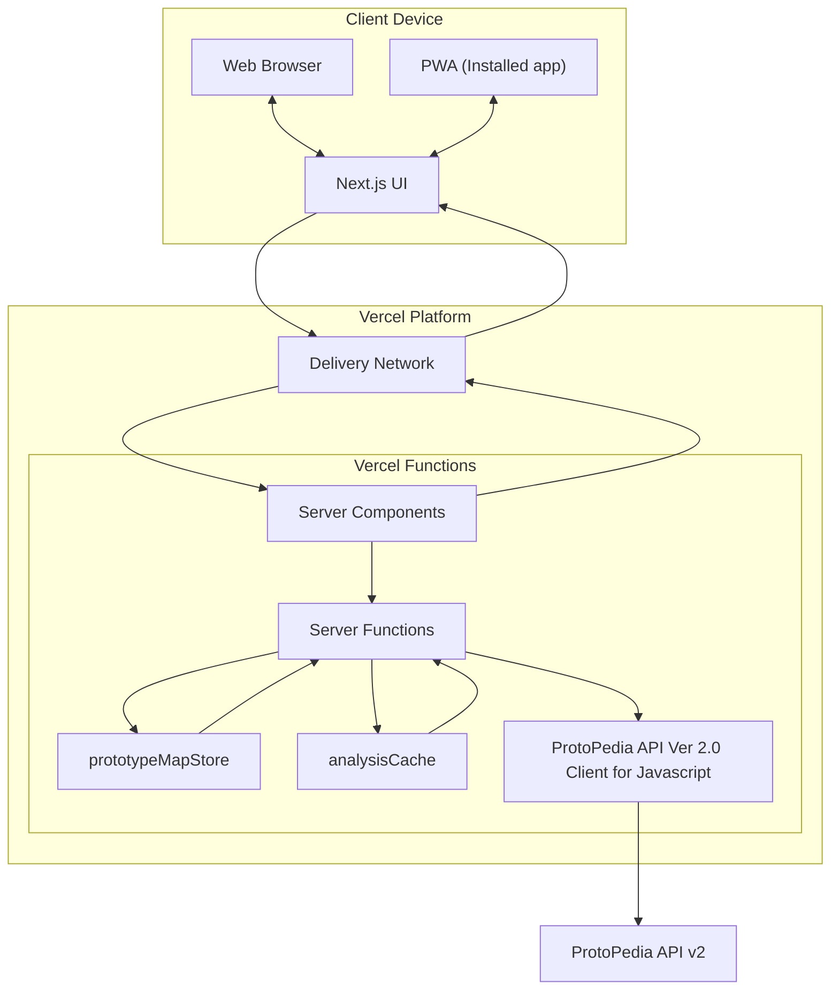

# Development Guide

This document covers local development, configuration, architecture notes, testing, and quality tooling for MUGEN ProtoPedia.

## Requirements

- Node.js 20+
- Package manager: pnpm (recommended), npm, or yarn

## Setup

```bash
# 1) Install deps
pnpm install

# 2) Configure environment
cp .env.example .env.local
# Edit .env.local as needed (see Configuration below)

# 3) Start dev server
pnpm dev
```

Open <http://localhost:3000>.

## Scripts

| Script                             | Purpose                           |
| ---------------------------------- | --------------------------------- |
| `pnpm dev`                         | Start Next.js dev server          |
| `pnpm build`                       | Production build                  |
| `pnpm start`                       | Run built app                     |
| `pnpm test`                        | Run unit tests with Vitest        |
| `pnpm test:watch`                  | Watch mode for tests              |
| `pnpm storybook`                   | Run Storybook locally (port 6006) |
| `pnpm build-storybook`             | Build static Storybook            |
| `pnpm lint` / `pnpm lint:fix`      | Lint codebase (ESLint)            |
| `pnpm format`                      | Format with Prettier              |
| `pnpm tool:save-sample-prototypes` | Save sample data for development  |

## Configuration (.env)

Adjust values in `.env.local`. For a fully annotated list, see `.env.example`.

| Variable                         | Description                                             |
| -------------------------------- | ------------------------------------------------------- |
| `PROTOPEDIA_API_V2_TOKEN`        | Auth token (optional; improves data surface)            |
| `PROTOPEDIA_API_V2_BASE_URL`     | Override API endpoint                                   |
| `PROTOPEDIA_API_V2_LOG_LEVEL`    | Client library log level (silent/error/warn/info/debug) |
| `PROTOTYPE_PAGE_LIMIT`           | Page size for candidate fetches (default 100)           |
| `LOG_LEVEL` / `LOG_PRETTY`       | Server logging controls (pino)                          |
| `RUN_LIVE_API_TESTS`             | Enables live API tests when `1` and a real token is set |
| `GOOGLE_SITE_VERIFICATION_TOKEN` | Google Search Console verification token                |

## Architecture & Data Flow

```text
User Action (tap / Enter)
   ↓
Keyboard Shortcut Hook (use-keyboard-shortcuts)
   ↓
Server Action (fetchRandomPrototype)
   ↓ (limit/offset clamped; validation; logging)
ProtoPedia API Client (protopedia-api-v2-client)
   ↓
Normalization + Analysis (normalizePrototype, analyzePrototypes)
   ↓
Snapshot Stores (prototype-map-store, analysis-cache)
   ↓
UI Components (Dashboard / Cards / Badges)
```

- Server actions live in `app/actions/prototypes.ts` and provide typed, validated endpoints for list, random, and id lookup.
- Normalization and analysis live under `lib/api/*` and `lib/utils/*`.
- In-memory stores provide snapshot + TTL behavior (`lib/stores/*`).

## Performance & Fetch Strategy

See `docs/data-fetching-strategy.md` for deep-dive. Highlights:

- Responses over ~2 MB skip Next.js data cache; prefer smaller pages when caching matters.
- Clamp limits between 1 and 10,000; measurement logs track elapsed ms and approximate payload size.
- Random selection occurs server-side for fairness and minimal client payload.

## Testing & Quality

- Unit tests: Vitest (`__tests__/*`)
- E2E tests: Playwright
- Mocking: MSW (`mocks/server.ts`, `mocks/handlers.ts`)
- Visual docs: Storybook (with a11y/docs add-ons)

Recommended loop:

```bash
pnpm lint
pnpm test
pnpm storybook
```

### Live API Tests (optional)

Set these to run the opt-in live test:

```bash
export RUN_LIVE_API_TESTS=1
export PROTOPEDIA_API_V2_TOKEN=your_real_token
pnpm test
```

## Coding Style

- TypeScript with strictness. Prefer clarity to cleverness.
- Destructure imports; use `import type` for pure types.
- Comparison rules:

```ts
// booleans: truthy checks
if (isValid) {
}

// strings/numbers: explicit comparison
if (name !== '') {
}
if (items.length > 0) {
}
```

## Contributing

1. Create a feature branch (`feat/your-topic`).
2. Follow Conventional Commits (`feat:`, `fix:`, `docs:`...).
3. Add/update tests/stories when changing behavior/UX.
4. Ensure `pnpm lint && pnpm test` pass before opening a PR.

## Tech Stack

### Frontend

- Next.js 15 (App Router / Server Functions)
- React 19

### UI

- Tailwind CSS 4.x
- shadcn/ui-based local components (see `components/ui/*`)
- lucide-react icons
- Icons should use either emojis or [Lucide](https://lucide.dev/).

### API Client

- [protopedia-api-v2-client - npm](https://www.npmjs.com/package/protopedia-api-v2-client)

### Tooling

- TypeScript 5.x
- ESLint (with `eslint-config-next`)
- Storybook 10
- GitHub Actions (CI)

### Logging

- pino (JSON structured logs)

### Testing

- Unit: Vitest
- E2E: Playwright
- Mocking: MSW
- Test data: `@faker-js/faker`

### Runtime

- Node.js 20+

### Hosting / Deployment

- Vercel

---

## Logging Policy

This project separates logging by runtime to avoid bundling server-only
dependencies into the browser and to make side-effects explicit.

- Server-only: `@/lib/logger.server` – Uses pino with optional pretty output via a direct pretty stream (`pino-pretty`), not via transport. Marked with `server-only` to prevent client imports.
- Browser-only: `@/lib/logger.client` – Thin console wrapper matching a small subset of the server logger API.

### How to use

Server contexts (server actions, API handlers, server utilities):

```ts
// app/actions/your-action.ts
import { logger } from '@/lib/logger.server';

export async function doStuff() {
    const log = logger.child({ action: 'doStuff' });
    log.info('start');
    // ...
    log.info('done');
}
```

Client contexts (client components, browser hooks, Storybook stories):

```ts
// components/thing.tsx (use client)
import { logger } from '@/lib/logger.client';

export function Thing() {
    logger.debug('render Thing');
    return null;
}
```

**Note:** The client logger's `child()` method returns a simplified `Logger` type that provides basic logging functionality (`debug`, `info`, `warn`, `error`, `child`). Unlike pino's full child logger API, it does not support advanced features such as nested serializers, custom formatters, or pino-specific options. If you need these features, use the server logger in server-side contexts.

### ESLint guardrails

ESLint enforces that `@/lib/logger.server` is only imported from server-only
contexts. Allowed paths include:

- `app/actions/**/*.{ts,tsx}`
- `lib/**/!(*.client).{ts,tsx}` (non-client TS/TSX under `lib/`)
- `lib/**/*server*.{ts,tsx}`
- `lib/api/**/*.{ts,tsx}`
- `lib/protopedia-client.ts`

Anywhere else, importing `@/lib/logger.server` triggers `no-restricted-imports`. Client-side code must use `@/lib/logger.client`.

### Environment variables

- `LOG_LEVEL`: `debug` | `info` | `warn` | `error` (server)
- `LOG_PRETTY`: `1`/`true` to enable pretty logs even outside dev (server)
- `PROTOPEDIA_API_V2_LOG_LEVEL`:
  `silent` | `error` | `warn` | `info` | `debug` (upstream client)

Defaults:

- Dev: pretty logging enabled by default
- Prod: JSON logs by default (set `LOG_PRETTY=1` to pretty-print)

### Do / Don’t

- Do import `@/lib/logger.server` in server code only.
- Do import `@/lib/logger.client` in browser code and Storybook.
- Don’t import `@/lib/logger.server` in client components or stories.
- Note: `pino-pretty` is statically imported to avoid Next.js bundling issues with worker-based transports.

## High-level system diagram



Access Modes:

- Web Browser: 標準アクセス。インストール不要で最新リソースを都度取得
- PWA App: インストール済みアイコンから起動
