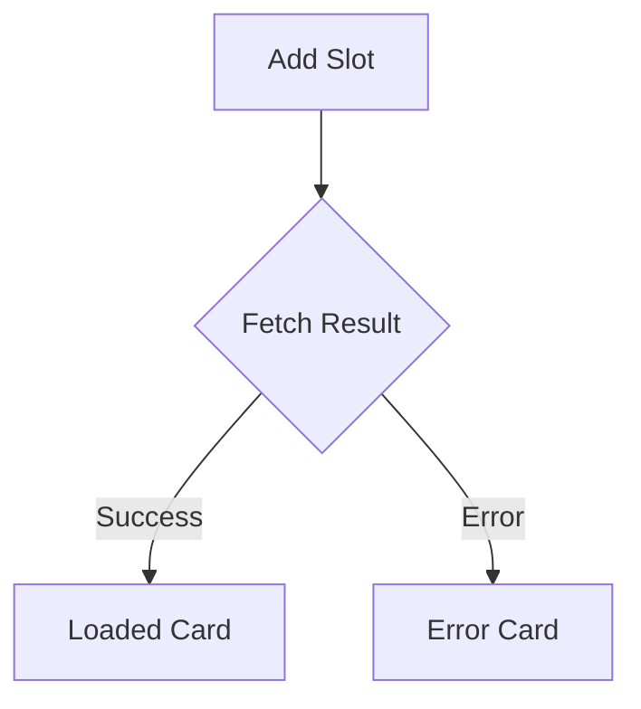
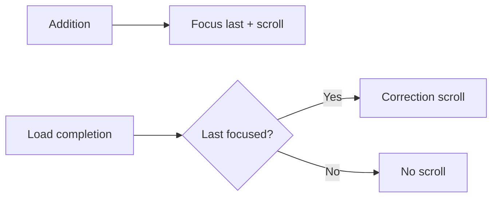

# Prototype Slot & Auto-Scroll Behavior

Related files:

- `app/page.tsx`: Main application component managing prototype slots and scroll behavior.
- `lib/utils/scroll-to-prototype.ts`: Utility function to handle scrolling to a specific prototype card.

Terminology:

- **Slot**: A placeholder in the UI representing a prototype load operation. Can be in one of three states: loading (skeleton), loaded (data card), or error (error card).
- **Card**: The rendered content within a slot, which can be a skeleton (while loading), a loaded prototype display, or an error message.

## 1. Slot & Card State Model

### Slot Structure

```ts
type PrototypeSlot = {
    id: number; // Monotonic insertion identifier
    prototype?: Prototype; // Loaded data object (undefined while loading)
    expectedPrototypeId?: number; // Requested ID (undefined for random loads)
    errorMessage?: string | null; // Error message if fetch failed
    isLoading: boolean; // True while fetch is in flight
};
```

### Lifecycle Transitions

1. Added: `{ prototype: undefined, isLoading: true }` → skeleton
2. Success: `prototype` populated; `isLoading: false` → loaded card
3. Failure: `errorMessage` set; `isLoading: false` → error card
4. Removal: slot removed from array



### Focus State (`currentFocusIndex`)

- Holds current focused slot index.
- On addition, auto-focus last index.
- User interactions (click / keyboard prev/next) override focus.
- Load completion does not mutate focus.

### Meaning of "Last Slot Focused"

- Indicates user is monitoring newest additions.
- Triggers alignment correction scrolls.

## 2. Auto-Scroll Specification

Auto-scroll occurs at two moments.

### 2-1. After Addition

**Trigger**: slot array length increased (`previousSlotsLength < currentLength`)

**Actions**:

1. Focus last index
2. Call `scrollToPrototypeByIndex(lastIndex)` with light wait (`waitForLayout: true, rafRounds: 1, timeout: 50ms`)

**Purpose**: Bring new skeleton into view immediately.

### 2-2. After Load Completion (Layout Shift Correction)

**Triggers**:

- Loading slot count decreased (≥ one transitioned true→false)
- Focus remains on last index

**Action**: `scrollToPrototypeByIndex(currentFocusIndex)` with very light wait (`rafRounds: 1, timeout: 50ms`)

**Purpose**: Realign if vertical growth above shifted the last card down.

### 2-3. No-Scroll Conditions

- Focus moved away from last before completion.
- Loading count unchanged.
- Empty slots or focus out of range.
- Defensive: length increase event but length is 0.

### 2-4. Utility Configuration Parameters

- `waitForLayout`: Perform layout stabilization wait.
- `layoutWaitRafRounds`: rAF cycles (default 2; 1 for lightweight correction).
- `layoutWaitTimeoutMs`: Post-rAF timeout (default 100ms; 50ms for correction).
- `extraOffset`: Extra spacing below fixed header (e.g. 16px).
- `headerOffsetProvider`: Custom header height provider (fallback: CSS variable `--header-offset`).

### 2-5. Design Rationale

| Case                           | Why Scroll             | Why Light Wait                                     |
| ------------------------------ | ---------------------- | -------------------------------------------------- |
| Addition                       | Immediate visibility   | Skeleton height predictable; heavy wait not needed |
| Load completion (last focused) | Correct vertical shift | Minor adjustment only                              |
| Not last focused               | Preserve user context  | Avoid surprise jumps                               |

## 3. Future Enhancements

- "Auto-follow last" toggle.
- Batch alignment optimization for bursts.
- Skeleton height approximation to reduce shift.

## 4. Pseudocode

```ts
// Addition
if (lengthIncreased) {
    select(lastIndex);
    scroll(lastIndex, { waitForLayout: true, rafRounds: 1, timeout: 50 });
}

// Load completion
if (loadingCountDecreased && focusedIndex === lastIndex) {
    scroll(focusedIndex, { waitForLayout: true, rafRounds: 1, timeout: 50 });
}
```

#### Scroll Trigger Flow (Mermaid)



## 5. Summary

- Slot lifecycle: Skeleton → Loaded | Error → (optional removal).
- Focus advances only on addition; load completion preserves focus.
- Auto-scroll triggers: addition and load completion (last focused).
- No-scroll safeguards avoid unwanted jumps.

<!-- Diagrams formerly in standalone section are now embedded near their related explanations. -->
